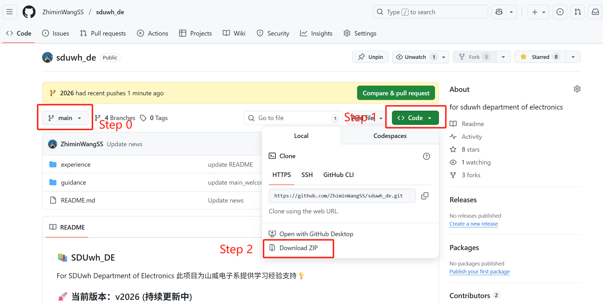

### 1. 通过 GitHub 网页链接点击 (最简单直接，但不方便后续跟进更新)
- Step 0 访问指定的分支
- Step 1 点击 `Code` 按钮
- Step 2 选择 `Download ZIP` 下载压缩包。



解压到本地后使用即可，或者可以访问特定的文件单独下载即可。

### 2. 通过git指令克隆仓库 (推荐，后续可以方便地通过git pull更新)
#### 首次使用 - 在本地克隆一个仓库
📖推荐阅读 [廖雪峰Git教程](https://liaoxuefeng.com/books/git/introduction/index.html)

Step 0 安装git（如果还没有安装）
Step 1 打开命令行工具（如Windows的命令提示符或macOS的Terminal）
Step 2 导航到你想要克隆仓库的本地目录（例如：D:\\codes\\）
Step 3 运行以下命令：
```
git clone https://github.com/ZhiminWangSS/sduwh_de.git
```
这将克隆整个仓库到当前目录。所有内容都可以在本地目录中找到。

#### 后续更新 - 将最新发布的内容更新到本地
Step 0 确保你已经在仓库目录中（例如：D:\\codes\\sduwh_de\\）
Step 1 运行以下命令：
```
git pull
```
这将从远程仓库获取最新的更改并合并到你的本地仓库。